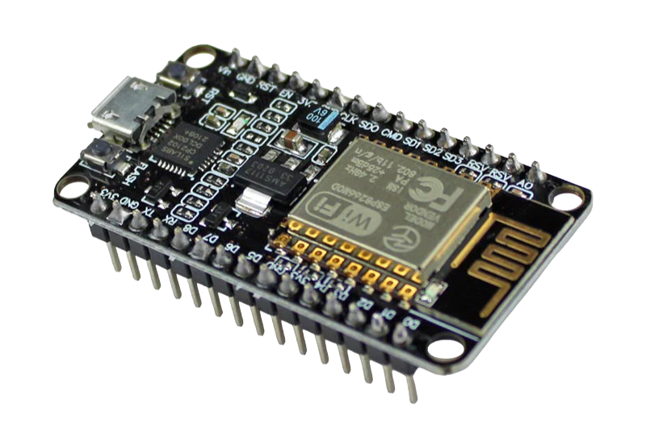

# ESP8266 Click Counter

This repository contains an Arduino code for a simple click counter using the ESP8266 microcontroller. The code includes a web server that displays the current click count and updates it in real-time.

## Hardware Requirements

- ESP8266 microcontroller
- Momentary push button (connected to pin D1)
- (Optional) EEPROM for storing click count persistently

## Installation

1. Clone this repository to your local machine.
2. Open the Arduino IDE and load the `click_counter.ino` file.
3. Configure the Arduino IDE for the ESP8266 board.
4. Upload the code to your ESP8266 device.

## Usage

1. Connect the ESP8266 to power.
2. Press the momentary push button to increment the click count.
3. Access the click count through a web browser by navigating to the ESP8266's IP address.

## Web Interface

The ESP8266 hosts a simple web interface accessible at the root ("/"):

- **Count:** Displays the current click count.
- **Real-time Update:** The page dynamically updates the count without manual refresh.

## API Endpoint

A dedicated API endpoint is available at "/counter" to retrieve the click count programmatically.

## WiFi Configuration

The ESP8266 sets up a WiFi access point with the following credentials:

- **SSID:** ESP8266
- **Password:** 12345678

## Serial Communication

The serial port communicates at a baud rate of 57600. Check the serial monitor for additional information.

## EEPROM Usage

The click count is stored persistently using the EEPROM library. The count is read from EEPROM on startup and updated whenever the button is pressed.

## Contributing

Feel free to contribute by opening issues or creating pull requests.

## License

This project is licensed under the [MIT License](LICENSE).
